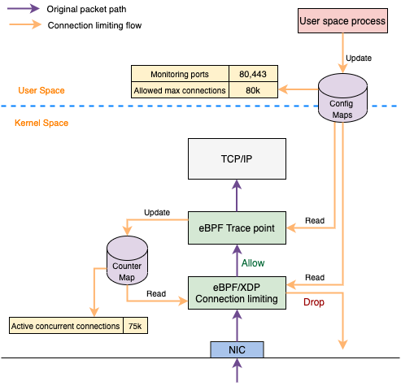

# Connection Limiting

Connection limiting uses tracepoints/kprobes to track the number of concurrent connections and gives the feedback (using BPF maps) to an XDP function that drops the connections if the number exceeds the max limit configured.

The tracepoint essentially listens to socket state change events, so it is notified whenever a connection goes to ESTABLISHED/CLOSED states. It then increments/decrements a counter (in a BPF map) accordingly. This map is shared with an XDP program, that drops further TCP connections on reaching a limit. It will start accepting connections again after the concurrent connections come down under the limit.

For more details, please visit https://medium.com/walmartglobaltech/introducing-walmarts-l3af-project-xdp-based-packet-processing-at-scale-81a13ff49572
