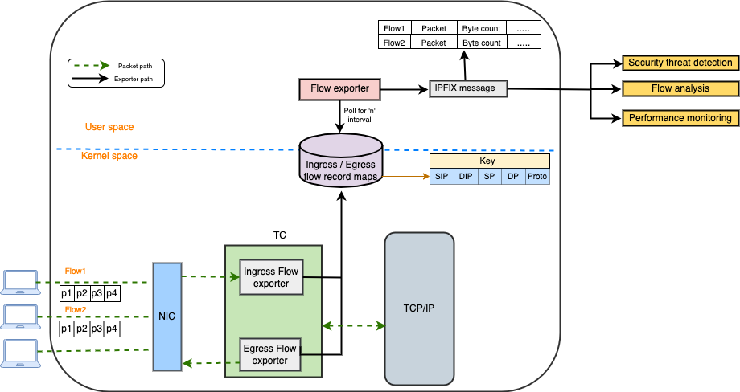

# Flow-exporter
The <a href=https://datatracker.ietf.org/doc/html/rfc7011> IPFIX(IP Flow Information Export) protocol </a> defines how IP flow information is to be formatted and transferred from an exporter to a collector.
This repo contains eBPF tc programs, which are using in ingress/egress to generate flow records from packets at an observation point and exports using IPFIX to a flow collector.
Currently, It supports both TCP and ICMP flows out-of-box. Flows templates are different for each of these.

Each TCP flow contains stats about following IPFIX information elements(<a href=https://www.iana.org/assignments/ipfix/ipfix.xhtml>List of IPFIX elements</a>)

<table>
<thead>
<tr>
<th>S.No</th>
<th>Element ID</th>
<th>Name</th>
</tr>
</thead>
<tbody>
<tr>
<td>1</td>
<td>1</td>
<td>octetDeltaCount</td>
</tr>
<tr>
<td>2</td>
<td>2</td>
<td>packetDeltaCount</td>
</tr>
<tr>
<td>3</td>
<td>4</td>
<td>protocolIdentifier</td>
</tr>
<tr>
<td>4</td>
<td>5</td>
<td>ipClassOfService</td>
</tr>
<tr>
<td>5</td>
<td>6</td>
<td>tcpControlBits</td>
</tr>
<tr>
<td>6</td>
<td>7</td>
<td>sourceTransportPort</td>
</tr>
<tr>
<td>7</td>
<td>8</td>
<td>sourceIPv4Address</td>
</tr>
<tr>
<td>8</td>
<td>10</td>
<td>ingressInterface</td>
</tr>
<tr>
<td>9</td>
<td>11</td>
<td>destinationTransportPort</td>
</tr>
<tr>
<td>10</td>
<td>12</td>
<td>destinationIPv4Address</td>
</tr>
<tr>
<td>11</td>
<td>14</td>
<td>egressInterface</td>
</tr>
<tr>
<td>12</td>
<td>52</td>
<td>minimumTTL</td>
</tr>
<tr>
<td>13</td>
<td>53</td>
<td>maximumTTL</td>
</tr>
<tr>
<td>14</td>
<td>61</td>
<td>flowDirection</td>
</tr>
<tr>
<td>15</td>
<td>22</td>
<td>flowStartSysUpTime</td>
</tr>
<tr>
<td>16</td>
<td>21</td>
<td>flowEndSysUpTime</td>
</tr>
<tr>
<td>17</td>
<td>195</td>
<td>ipDiffServCodePoint</td>
</tr>
</table>

ICMP flows has icmpTypeCodeIPv4 instead of tcpControlBits field.
As IPFIX can support variable length fields, We can easily extend this solution to add custom elements information apart of the elements defined in <a href=https://www.iana.org/assignments/ipfix/ipfix.xhtml> List of IPFIX elements</a>. This additional custom details can bring a deeper understanding of network traffic.

## How it works
eBPF programs are attached to traffic control Ingress / Egress hooks to extract packets metadata and update them in BPF maps. 5-Tuple (src_addr, dst_addr, src_port, dst_port and proto) hash is the key in maps. Kernel programs updates the maps with raw information about flows. For every 10secs user programs read maps  and populates data for IPFIX messages as per defined templates. These IPFIX messages are sent to the configured collector to analyse further. By default flow idle timeout is 30seconds. If any flow is not received packets more than 30 secs, that flow record gets deleted from the maps in user program. Idle flow timeout can be configured.

### How to build
<a href=https://github.com/l3af-project/l3af-arch/blob/main/dev_environment/>L3AF Development Environment</a> contains steps to build and test flow exporter using vagrant
