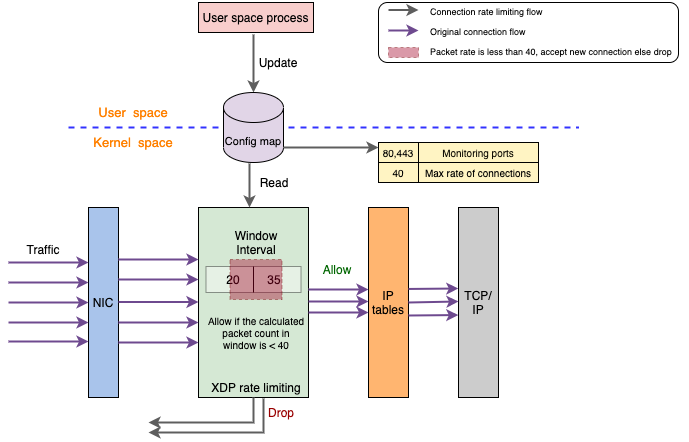

# Connection Ratelimiting

Connection ratelimiting uses a sliding window algorithm for managing the connections.

This kernel function based on XDP  keeps a counter for number of connections received in the previous window (say 1s) and also keeps track of the connections it is receiving in the current window. And based on the current time, it calculates what percentage of the sliding window is in the current interval vs previous interval and determines whether to accept or drop the packet.

For more details, please visit https://medium.com/walmartglobaltech/introducing-walmarts-l3af-project-xdp-based-packet-processing-at-scale-81a13ff49572.
           
